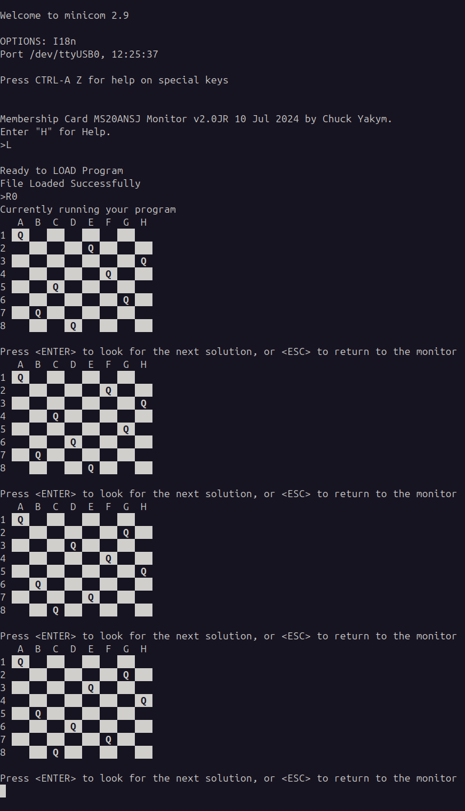

# 8 Queens Problem

How to place 8 queens on a chessboard so that they are not attacking each other.

This recursive problem is well suited to investigate multiple ways RCA-1802 calls a subroutine.

The program presented here discovers all 92 solutions for [8 Queen Problem](https://en.wikipedia.org/wiki/Eight_queens_puzzle).

SPDX-FileCopyrightText: © 2025 Damir Maleničić,
SPDX-License-Identifier: MIT
